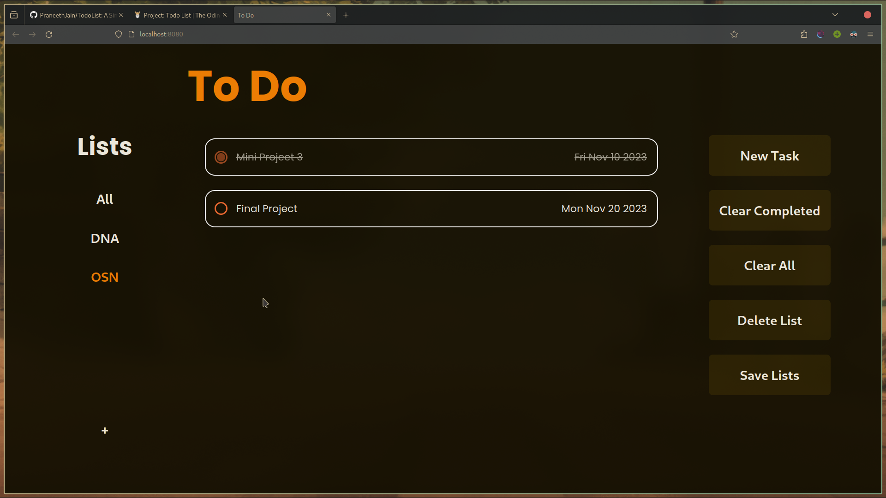
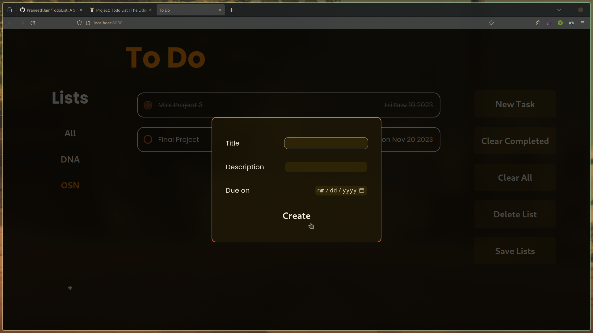

# To Do List

A simple to do list made using html, css, js and built using webpack.
[The Odin Project Todo List](https://www.theodinproject.com/lessons/node-path-javascript-todo-list)

[Live preview](https://praneethjain.github.io/TodoList/)

## Features
- Multiple lists to separate tasks
- Save lists to local storage
- Clear all completed tasks

## Screenshots

## Develop
- `npm run start`
